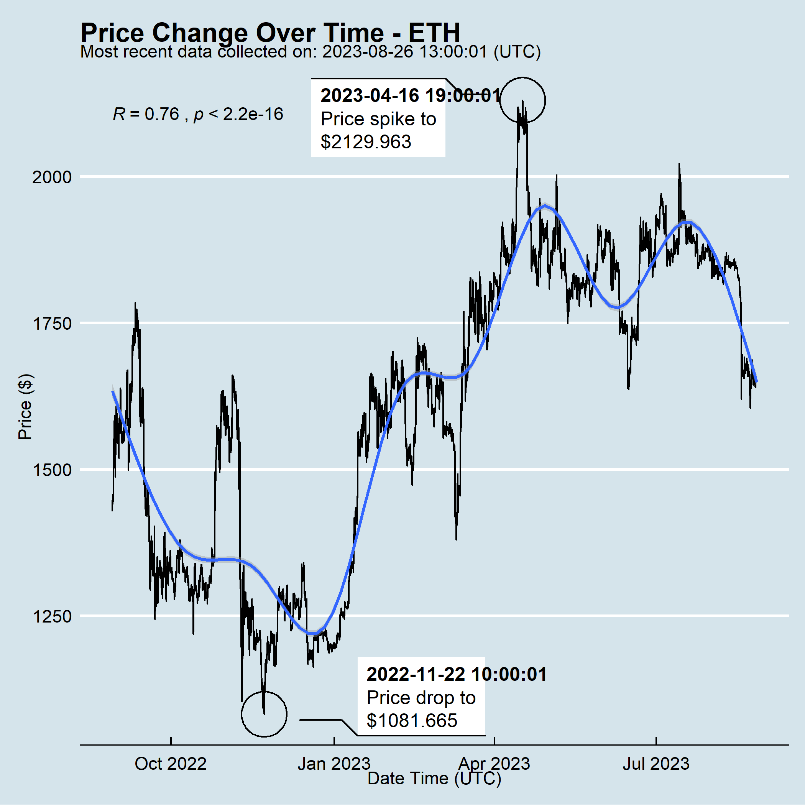

# [R-Markdown-Gallery - Work in progress](http://r-markdown-gallery.com/)

This website showcases the many different kinds of output documents you can produce using R Markdown, and refreshes all outputs daily with the latest data from the cryptocurrency markets.

1. An [R script connects to a data source that refreshes every hour and creates a visualization](https://github.com/ries9112/R-Markdown-Gallery/blob/main/script.R):

2. The data and visualization are then displayed in a variety of different formats using the same structure and code, but creating [different kinds of documents](https://r-markdown-gallery.com/gallery.html) specifying the R Markdown output type accordingly and rendering each one.

3. The results shown on the website are [automatically refreshed every 24 hours](https://github.com/ries9112/R-Markdown-Gallery/actions) using open source tools that are ideal for both personal work as well as work done within an organization. You can view the status of the latest runs at the link above.
